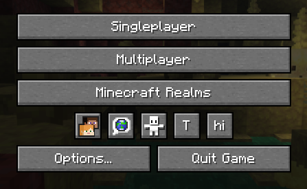

## Implementation

### 1. Configure `build.gradle`

```groovy
repositories {
    maven {
        url "https://api.modrinth.com/maven"
    }
}
dependencies {
    implementation "maven.modrinth:iconbuttonsapi:${project.iconbuttonsapi_version}+mc-${project.minecraft_version}"
}
```


### 2. Configure `gradle.properties`

Add the following lines to your `gradle.properties` file and replace the values with your target versions:

```properties
iconbuttonsapi_version=1.0.0
```

### 3. Configure `fabric.mod.json`

Don't forget to declare the dependency in your `fabric.mod.json` so Fabric Loader can verify it at runtime:

```json
"depends": {
    ...
    "iconbuttonsapi": ">=1.0.0"
}
```
##  Usage

The main entry point of the API is the `IconButtons` class. It provides methods to easily add any `AbstractWidget` (like buttons, sliders, etc.) to the Minecraft Title Screen or Pause Menu rows.

You can register buttons to stay visible permanently or control their visibility dynamically using a `BooleanSupplier`.

### Example

```java

public class ExampleModClient implements ClientModInitializer {  
    public static final String MOD_ID = "iconbuttonsapi";  
    public static final Logger LOGGER = LoggerFactory.getLogger(MOD_ID);
    public static boolean willShow = true;

    @Override
    public void onInitializeClient() {
        Button buttonHi = Button.builder(
                Component.literal("hi"),
                b -> {
                    LOGGER.info("Hi!");
                }
        ).size(IconButtons.getButtonWidthAndHeight(), IconButtons.getButtonWidthAndHeight()).build();
        Button buttonToggleShow = Button.builder(
                Component.literal("T"),
                b -> {
                    willShow = !willShow;
                }
        ).size(IconButtons.getButtonWidthAndHeight(), IconButtons.getButtonWidthAndHeight()).build();

        IconButtons.addTitleScreenButton(buttonHi, () -> willShow);
        IconButtons.addPauseScreenButton(buttonHi, () -> willShow);

        IconButtons.addTitleScreenButton(buttonToggleShow);
        IconButtons.addPauseScreenButton(buttonToggleShow);
    }
}
```

###  Features 
* **Automatic Positioning**: You don't need to specify coordinates (`X` and `Y`) for your widgets. The API calculates and applies positioning automatically, arranging your buttons into a neat row.
* **Size**: It is recommended to use `IconButtons.getButtonWidthAndHeight()` (returns `20`) for the correct size to ensure your icons fit perfectly alongside vanilla social, feedback, and bug report icons.


